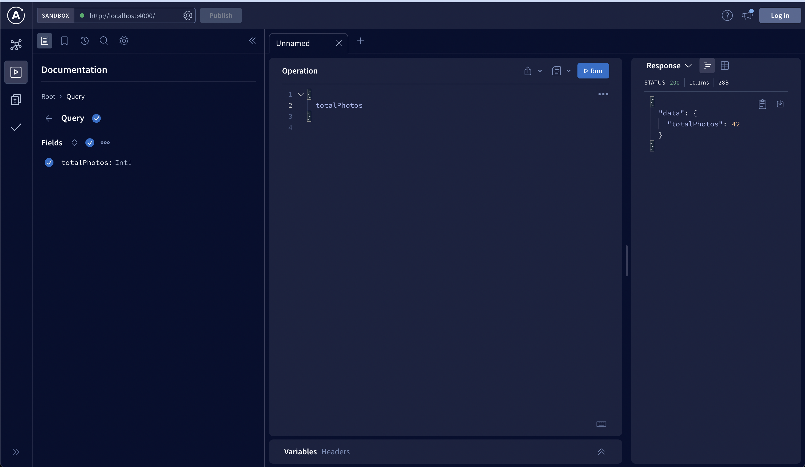
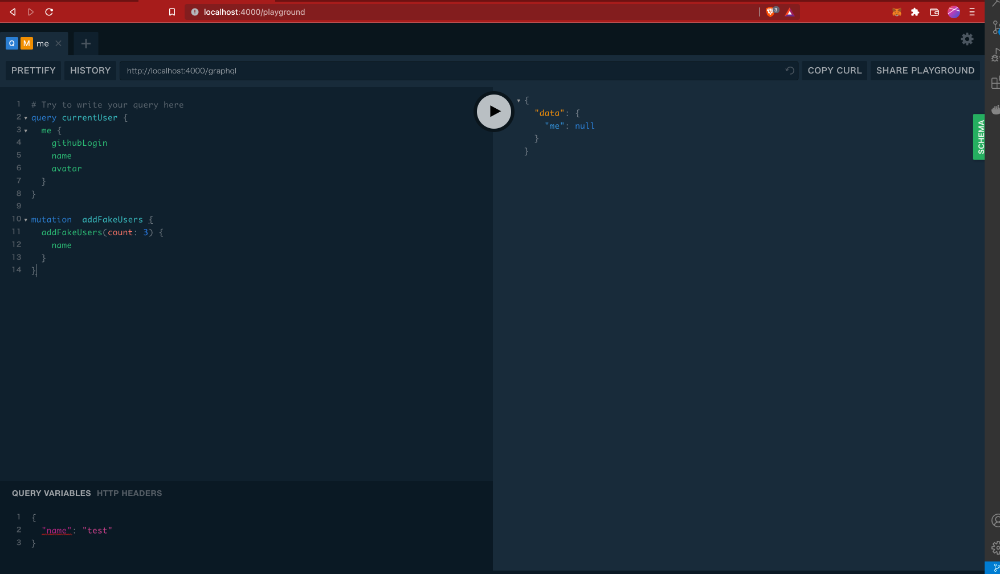

# GraphQLRepo

GraphQL 学習用のリポジトリです。

## GraphQL とは

GraphQL は API 向けに作られたクエリ言語およびランタイムのこと。  
クエリはどの言語でも同じ。

## QraghQL の例

```cmd
curl 'http://showtooth.herokuapp.com/' -H 'Content-Type: application/json' --data '{"query":"{allLifts {name}}"}'
```

レスポンス結果

```html
<!DOCTYPE html>
<html>
  <head>
    <meta name="viewport" content="width=device-width, initial-scale=1" />
    <meta charset="utf-8" />
    <title>Heroku | Application Error</title>
    <style media="screen">
      html,
      body,
      iframe {
        margin: 0;
        padding: 0;
      }
      html,
      body {
        height: 100%;
        overflow: hidden;
      }
      iframe {
        width: 100%;
        height: 100%;
        border: 0;
      }
    </style>
  </head>
  <body>
    <iframe src="//www.herokucdn.com/error-pages/no-such-app.html"></iframe>
  </body>
</html>
```

ミューテーションを利用した場合

```cmd
curl 'http://showtooth.herokuapp.com/' -H 'Content-Type: application/json' --data '{"query":"mutation {setLiftStatus(id: "panorama" status: OPEN) {name status}}"}'
```

レスポンス結果

```html
<!DOCTYPE html>
<html>
  <head>
    <meta name="viewport" content="width=device-width, initial-scale=1" />
    <meta charset="utf-8" />
    <title>Heroku | Application Error</title>
    <style media="screen">
      html,
      body,
      iframe {
        margin: 0;
        padding: 0;
      }
      html,
      body {
        height: 100%;
        overflow: hidden;
      }
      iframe {
        width: 100%;
        height: 100%;
        border: 0;
      }
    </style>
  </head>
  <body>
    <iframe src="//www.herokucdn.com/error-pages/no-such-app.html"></iframe>
  </body>
</html>
```

## Snowtppth API での例

クエリ例

```graphql
query {
  allLifts {
    name
    status
  }
}
```

レスポンス

```json
{
  "data": {
    "allLifts": [
      {
        "name": "Astra Express",
        "status": "OPEN"
      },
      {
        "name": "Jazz Cat",
        "status": "OPEN"
      },
      {
        "name": "Jolly Roger",
        "status": "OPEN"
      },
      {
        "name": "Neptune Rope",
        "status": "OPEN"
      },
      {
        "name": "Panorama",
        "status": "HOLD"
      },
      {
        "name": "Prickly Peak",
        "status": "OPEN"
      },
      {
        "name": "Snowtooth Express",
        "status": "OPEN"
      },
      {
        "name": "Summit",
        "status": "CLOSED"
      },
      {
        "name": "Wally's",
        "status": "HOLD"
      },
      {
        "name": "Western States",
        "status": "CLOSED"
      },
      {
        "name": "Whirlybird",
        "status": "HOLD"
      }
    ]
  }
}
```

複数のクエリをまとめて実行する場合

```query
query liftsAndTrails {
  open: liftCount(status: OPEN)
  chairlifts: allLifts {
    liftName: name
    status
  }
  skiSlopes: allTrails {
    name
    difficulty
  }
}
```

レスポンスの例

```json
{
  "data": {
    "open": 6,
    "chairlifts": [
      {
        "liftName": "Astra Express",
        "status": "OPEN"
      },
      {
        "liftName": "Jazz Cat",
        "status": "OPEN"
      },
      {
        "liftName": "Jolly Roger",
        "status": "OPEN"
      },
      {
        "liftName": "Neptune Rope",
        "status": "OPEN"
      },
      {
        "liftName": "Panorama",
        "status": "HOLD"
      },
      {
        "liftName": "Prickly Peak",
        "status": "OPEN"
      },
      {
        "liftName": "Snowtooth Express",
        "status": "OPEN"
      },
      {
        "liftName": "Summit",
        "status": "CLOSED"
      },
      {
        "liftName": "Wally's",
        "status": "HOLD"
      },
      {
        "liftName": "Western States",
        "status": "CLOSED"
      },
      {
        "liftName": "Whirlybird",
        "status": "HOLD"
      }
    ],
    "skiSlopes": [
      {
        "name": "Blue Bird",
        "difficulty": "intermediate"
      },
      {
        "name": "Blackhawk",
        "difficulty": "intermediate"
      },
      {
        "name": "Duck's Revenge",
        "difficulty": "intermediate"
      },
      {
        "name": "Ice Streak",
        "difficulty": "intermediate"
      },
      {
        "name": "Parachute",
        "difficulty": "intermediate"
      },
      {
        "name": "Goosebumps",
        "difficulty": "advanced"
      },
      {
        "name": "River Run",
        "difficulty": "intermediate"
      },
      {
        "name": "Cape Cod",
        "difficulty": "intermediate"
      },
      {
        "name": "Grandma",
        "difficulty": "expert"
      },
      {
        "name": "Wild Child",
        "difficulty": "advanced"
      },
      {
        "name": "Old Witch",
        "difficulty": "expert"
      },
      {
        "name": "Dance Fight",
        "difficulty": "beginner"
      },
      {
        "name": "Sneaky Pete",
        "difficulty": "beginner"
      },
      {
        "name": "Bear Cave",
        "difficulty": "intermediate"
      },
      {
        "name": "Humpty Dumpty",
        "difficulty": "intermediate"
      },
      {
        "name": "Meatball",
        "difficulty": "beginner"
      },
      {
        "name": "Early Riser",
        "difficulty": "intermediate"
      },
      {
        "name": "Sunset",
        "difficulty": "intermediate"
      },
      {
        "name": "Home Run",
        "difficulty": "beginner"
      },
      {
        "name": "Crosscut",
        "difficulty": "beginner"
      },
      {
        "name": "Ocean Breeze",
        "difficulty": "intermediate"
      },
      {
        "name": "Songstress",
        "difficulty": "expert"
      },
      {
        "name": "Mountain Run",
        "difficulty": "intermediate"
      },
      {
        "name": "Summit Saunter",
        "difficulty": "intermediate"
      },
      {
        "name": "Hemmed Slacks",
        "difficulty": "intermediate"
      },
      {
        "name": "David's Dive",
        "difficulty": "advanced"
      },
      {
        "name": "Quarry Chute",
        "difficulty": "expert"
      },
      {
        "name": "Crooked Chute",
        "difficulty": "expert"
      },
      {
        "name": "Mark's Chute",
        "difficulty": "expert"
      },
      {
        "name": "The Terrible Chute",
        "difficulty": "expert"
      },
      {
        "name": "Magma Chute",
        "difficulty": "expert"
      },
      {
        "name": "Saddleback Chute",
        "difficulty": "expert"
      },
      {
        "name": "Omega Chute",
        "difficulty": "intermediate"
      },
      {
        "name": "Adirondack Chute",
        "difficulty": "expert"
      },
      {
        "name": "Chicken Out Traverse",
        "difficulty": "intermediate"
      },
      {
        "name": "Blue Streak",
        "difficulty": "advanced"
      },
      {
        "name": "Hoya Saxa",
        "difficulty": "advanced"
      },
      {
        "name": "Michigan Ave",
        "difficulty": "intermediate"
      },
      {
        "name": "Parker Downhill",
        "difficulty": "advanced"
      },
      {
        "name": "Wiggle Waggle",
        "difficulty": "beginner"
      },
      {
        "name": "Meow Face",
        "difficulty": "intermediate"
      },
      {
        "name": "Golden Ticket",
        "difficulty": "expert"
      },
      {
        "name": "Summit Bowl",
        "difficulty": "advanced"
      },
      {
        "name": "Hangar Bowl",
        "difficulty": "intermediate"
      },
      {
        "name": "Big Gully",
        "difficulty": "expert"
      },
      {
        "name": "Bigger Gully",
        "difficulty": "expert"
      },
      {
        "name": "Broadway Bowl",
        "difficulty": "intermediate"
      },
      {
        "name": "Fish Bowl",
        "difficulty": "advanced"
      },
      {
        "name": "Way Out",
        "difficulty": "beginner"
      },
      {
        "name": "Buford",
        "difficulty": "beginner"
      },
      {
        "name": "Slippy Stream",
        "difficulty": "beginner"
      },
      {
        "name": "Peacock",
        "difficulty": "beginner"
      },
      {
        "name": "Fun Run",
        "difficulty": "beginner"
      },
      {
        "name": "Sweet Treat",
        "difficulty": "beginner"
      },
      {
        "name": "Stump Alley",
        "difficulty": "intermediate"
      },
      {
        "name": "Centennial",
        "difficulty": "advanced"
      },
      {
        "name": "Biennial",
        "difficulty": "advanced"
      },
      {
        "name": "Millenial",
        "difficulty": "advanced"
      },
      {
        "name": "Searcher",
        "difficulty": "intermediate"
      },
      {
        "name": "White Lightning",
        "difficulty": "advanced"
      },
      {
        "name": "Richard's Return",
        "difficulty": "beginner"
      },
      {
        "name": "Head Chutes Gate A",
        "difficulty": "expert"
      },
      {
        "name": "Head Chutes Gate B",
        "difficulty": "expert"
      },
      {
        "name": "Head Chutes Gate C",
        "difficulty": "expert"
      },
      {
        "name": "Bird Glade",
        "difficulty": "expert"
      },
      {
        "name": "Big Bird",
        "difficulty": "expert"
      },
      {
        "name": "Roller Park",
        "difficulty": "expert"
      },
      {
        "name": "Owl Glade",
        "difficulty": "expert"
      },
      {
        "name": "Whippersnapper Ridge",
        "difficulty": "expert"
      },
      {
        "name": "Drop In",
        "difficulty": "expert"
      },
      {
        "name": "Mosh Pit",
        "difficulty": "advanced"
      }
    ]
  }
}
```

#### 条件付きクエリ

```cmd
query closedLifts {
  allLifts(status: CLOSED){
    name
    status
  }
}
```

レスポンスの例

```json
{
  "data": {
    "allLifts": [
      {
        "name": "Summit",
        "status": "CLOSED"
      },
      {
        "name": "Western States",
        "status": "CLOSED"
      }
    ]
  }
}
```

id が jazz-cat のデータを取得するクエリ

```cmd
query jazzCatStatus {
  Lift(id: "jazz-cat"){
    name
    status
    night
    elevationGain
  }
}
```

レスポンスの例

```json
{
  "data": {
    "Lift": {
      "name": "Jazz Cat",
      "status": "OPEN",
      "night": false,
      "elevationGain": 1230
    }
  }
}
```

#### フラグメントを活用したクエリ

```cmd
# Lift型のフラグメント
fragment lifeInfo on Lift {
  name
  status
  capacity
  night
  elevationGain
}

# クエリ
query jazzCatStatus {
  Lift(id: "jazz-cat"){
    ...lifeInfo
    trailAccess {
      name
      difficulty
    }
  }
  Trail(id: "river-run") {
    name
    difficulty
    accessedByLifts {
      ...lifeInfo
    }
  }
}
```

レスポンス結果

```json
{
  "data": {
    "Lift": {
      "name": "Jazz Cat",
      "status": "OPEN",
      "capacity": 2,
      "night": false,
      "elevationGain": 1230,
      "trailAccess": [
        {
          "name": "Goosebumps",
          "difficulty": "advanced"
        },
        {
          "name": "River Run",
          "difficulty": "intermediate"
        },
        {
          "name": "Duck's Revenge",
          "difficulty": "intermediate"
        },
        {
          "name": "Cape Cod",
          "difficulty": "intermediate"
        },
        {
          "name": "Grandma",
          "difficulty": "expert"
        },
        {
          "name": "Wild Child",
          "difficulty": "advanced"
        },
        {
          "name": "Old Witch",
          "difficulty": "expert"
        }
      ]
    },
    "Trail": {
      "name": "River Run",
      "difficulty": "intermediate",
      "accessedByLifts": [
        {
          "name": "Jazz Cat",
          "status": "OPEN",
          "capacity": 2,
          "night": false,
          "elevationGain": 1230
        }
      ]
    }
  }
}
```

#### ユニオン型を活用したクエリ

```cmd
#フラグメント
fragment workout on Workout {
  name
  reps
}

# フラグメント2
fragment study on StudyGroup {
  name
  subject
  students
}

#クエリ
query today {
  agenda {
    ...workout
    ...study
  }
}
```

#### 書き込み操作する場合(ミューテーションを利用する)

「Jazz-cat」リフトの稼働状況を更新するクエリ

```cmd
mutation closedLift {
  setLiftStatus(id: "jazz-cat" status: CLOSED) {
    name
    status
  }
}
```

レスポンス

```json
{
  "data": {
    "setLiftStatus": {
      "name": "Jazz Cat",
      "status": "CLOSED"
    }
  }
}
```

クエリ引数に変数を利用した場合

```cmd
mutation crateSong($title:String! $numberOne:Int $by:String!) {
  addSong(title: $title, numberOne: $numberOne, performerName: $by) {
    id
    title
    numberOne
  }
}
```

#### サブスクリプションを利用したクエリ

データを監視して更新されたタイミングで取得する

```cmd
# サブスクリプション
subscription {
  liftStatusChange {
    name
    capacity
    status
  }
}

```

#### イントロスペクション

API スキーマを取得するクエリ

```cmd
# イントロスペクション

query {
  __schema {
    types {
      name
      description
    }
  }
}

```

レスポンス

```json
{
  "data": {
    "__schema": {
      "types": [
        {
          "name": "Lift",
          "description": "A `Lift` is a chairlift, gondola, tram, funicular, pulley, rope tow, or other means of ascending a mountain."
        },
        {
          "name": "ID",
          "description": "The `ID` scalar type represents a unique identifier, often used to refetch an object or as key for a cache. The ID type appears in a JSON response as a String; however, it is not intended to be human-readable. When expected as an input type, any string (such as `\"4\"`) or integer (such as `4`) input value will be accepted as an ID."
        },
        {
          "name": "String",
          "description": "The `String` scalar type represents textual data, represented as UTF-8 character sequences. The String type is most often used by GraphQL to represent free-form human-readable text."
        },
        {
          "name": "Int",
          "description": "The `Int` scalar type represents non-fractional signed whole numeric values. Int can represent values between -(2^31) and 2^31 - 1."
        },
        {
          "name": "Boolean",
          "description": "The `Boolean` scalar type represents `true` or `false`."
        },
        {
          "name": "Trail",
          "description": "A `Trail` is a run at a ski resort"
        },
        {
          "name": "LiftStatus",
          "description": "An enum describing the options for `LiftStatus`: `OPEN`, `CLOSED`, `HOLD`"
        },
        {
          "name": "TrailStatus",
          "description": "An enum describing the options for `TrailStatus`: `OPEN`, `CLOSED`"
        },
        {
          "name": "SearchResult",
          "description": "This union type returns one of two types: a `Lift` or a `Trail`. When we search for a letter, we'll return a list of either `Lift` or `Trail` objects."
        },
        {
          "name": "Query",
          "description": null
        },
        {
          "name": "Mutation",
          "description": null
        },
        {
          "name": "Subscription",
          "description": null
        },
        {
          "name": "CacheControlScope",
          "description": null
        },
        {
          "name": "Upload",
          "description": "The `Upload` scalar type represents a file upload."
        },
        {
          "name": "__Schema",
          "description": "A GraphQL Schema defines the capabilities of a GraphQL server. It exposes all available types and directives on the server, as well as the entry points for query, mutation, and subscription operations."
        },
        {
          "name": "__Type",
          "description": "The fundamental unit of any GraphQL Schema is the type. There are many kinds of types in GraphQL as represented by the `__TypeKind` enum.\n\nDepending on the kind of a type, certain fields describe information about that type. Scalar types provide no information beyond a name, description and optional `specifiedByUrl`, while Enum types provide their values. Object and Interface types provide the fields they describe. Abstract types, Union and Interface, provide the Object types possible at runtime. List and NonNull types compose other types."
        },
        {
          "name": "__TypeKind",
          "description": "An enum describing what kind of type a given `__Type` is."
        },
        {
          "name": "__Field",
          "description": "Object and Interface types are described by a list of Fields, each of which has a name, potentially a list of arguments, and a return type."
        },
        {
          "name": "__InputValue",
          "description": "Arguments provided to Fields or Directives and the input fields of an InputObject are represented as Input Values which describe their type and optionally a default value."
        },
        {
          "name": "__EnumValue",
          "description": "One possible value for a given Enum. Enum values are unique values, not a placeholder for a string or numeric value. However an Enum value is returned in a JSON response as a string."
        },
        {
          "name": "__Directive",
          "description": "A Directive provides a way to describe alternate runtime execution and type validation behavior in a GraphQL document.\n\nIn some cases, you need to provide options to alter GraphQL's execution behavior in ways field arguments will not suffice, such as conditionally including or skipping a field. Directives provide this by describing additional information to the executor."
        },
        {
          "name": "__DirectiveLocation",
          "description": "A Directive can be adjacent to many parts of the GraphQL language, a __DirectiveLocation describes one such possible adjacencies."
        }
      ]
    }
  }
}
```

Lift 型の詳細を知りたい時のクエリ

```cmd
# イントロスペクション

query liftDetails{
  __type(name: "Lift") {
    name
    fields {
      name
      description
      type {
        name
      }
    }
  }
}
```

レスポンス

```json
{
  "data": {
    "__type": {
      "name": "Lift",
      "fields": [
        {
          "name": "id",
          "description": "The unique identifier for a `Lift` (id: \"panorama\")",
          "type": {
            "name": null
          }
        },
        {
          "name": "name",
          "description": "The name of a `Lift`",
          "type": {
            "name": null
          }
        },
        {
          "name": "status",
          "description": "The current status for a `Lift`: `OPEN`, `CLOSED`, `HOLD`",
          "type": {
            "name": "LiftStatus"
          }
        },
        {
          "name": "capacity",
          "description": "The number of people that a `Lift` can hold",
          "type": {
            "name": null
          }
        },
        {
          "name": "night",
          "description": "A boolean describing whether a `Lift` is open for night skiing",
          "type": {
            "name": null
          }
        },
        {
          "name": "elevationGain",
          "description": "The number of feet in elevation that a `Lift` ascends",
          "type": {
            "name": null
          }
        },
        {
          "name": "trailAccess",
          "description": "A list of trails that this `Lift` serves",
          "type": {
            "name": null
          }
        }
      ]
    }
  }
}
```

## 5 章終了時点でのクエリとミューテーション例

フェイクユーザーを追加するミューテーション

```cmd
mutation  addFakeUsers {
  addFakeUsers(count: 3) {
    name
  }
}
```

レスポンス例

```json
{
  "data": {
    "addFakeUsers": [
      {
        "name": "Elias Hannula"
      },
      {
        "name": "Eric Guevara"
      },
      {
        "name": "Christopher Elliott"
      }
    ]
  }
}
```

ユーザー情報を取得するクエリ

```cmd
query currentUser {
  me {
    githubLogin
    name
    avatar
  }
}
```

レスポンス例

```json
{
  "data": {
    "me": null
  }
}
```

## Apollo Server により GraphQL サーバーを構築する場合

`npm i apollo-server graphql nodemon`

## Apollo Server 起動例



## Playground の開き方

`npm run start`

http://localhost:4000/playground

playground の起動例



## mongoDB の起動方法

`brew services start mongodb-community@6.0`

```cmd
==> Successfully started `mongodb-community` (label: homebrew.mxcl.mongodb-community)
```

デフォルトでは次の URL でアクセスできる。
`http://localhost:27017/`

## mongoDB の停止方法

`brew services stop mongodb-community@6.0`

## mongod の使い方

` mongod --version`

## MongoDB Shell の使い方

ログイン方法  
`mongo -u mongo -p --port 27017 --host 127.0.0.1`

ユーザー新規作成方法(1 例)

1. `mongo`
2. `use admin`
3. `db.createUser({user:"test", pwd:"test", roles:["root"]})`

DB の確認  
`show dbs;`

```shell
admin   0.000GB
config  0.000GB
local   0.000GB
```

DB の状態確認  
`db.stats()`

```shell
{
	"db" : "test",
	"collections" : 0,
	"views" : 0,
	"objects" : 0,
	"avgObjSize" : 0,
	"dataSize" : 0,
	"storageSize" : 0,
	"indexes" : 0,
	"indexSize" : 0,
	"totalSize" : 0,
	"scaleFactor" : 1,
	"fsUsedSize" : 0,
	"fsTotalSize" : 0,
	"ok" : 1
}
```

### .env ファイルに必要な設定

1. DB ホスト ⇨ mongodb://127.0.0.1:27017/を設定しておく (デフォルト)
2. GitHub で OAuth の設定をしておいてクライアント ID とクレデンシャルを設定しておく

#### 参考文献

1. <a href="https://www.oreilly.co.jp/books/9784873118932/">初めての GraphQL</a>
2. <a href="https://graphqlworkshop.com/">GraphQLWorkShop</a>
3. <a href="https://graphql.org/">GraghQL の公式サイト</a>
4. <a href="https://swapi.dev/">SWAPI.dev</a>
5. [SWAPI](https://graphql.org/swapi-graphql/)
6. [Snowtooth API](http://snowtooth.moonhighway.com)
7. [You must `await server.start()` before calling `server.applyMiddleware()`の解決方法](https://qiita.com/kajima/items/2405a44a2c6f14de7919)
8. [MongoDB の公式サイト](https://www.mongodb.com/docs/manual/tutorial/install-mongodb-on-os-x/)
9. [MongoDB 操作ガイド](https://www.wakuwakubank.com/posts/784-server-mongodb-introduction/)
10. [ApolloClient の公式ドキュメント](https://www.apollographql.com/docs/react/get-started)
